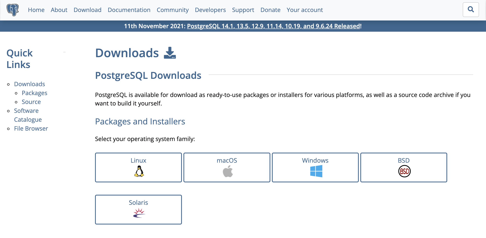
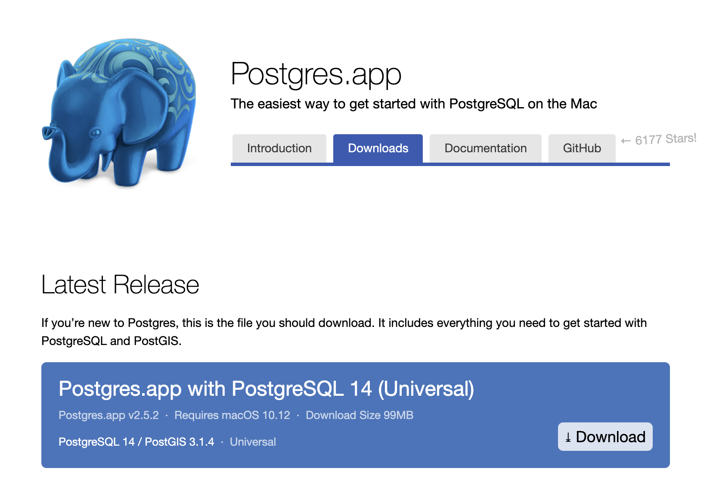
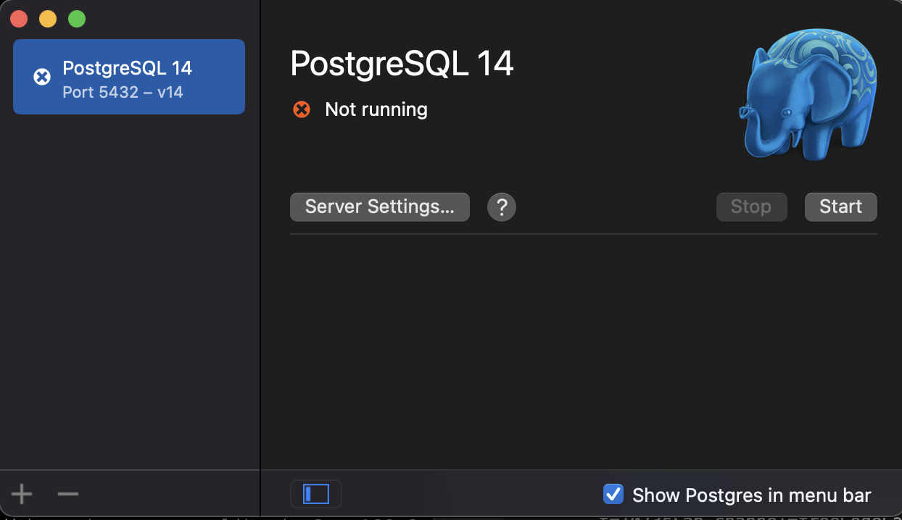
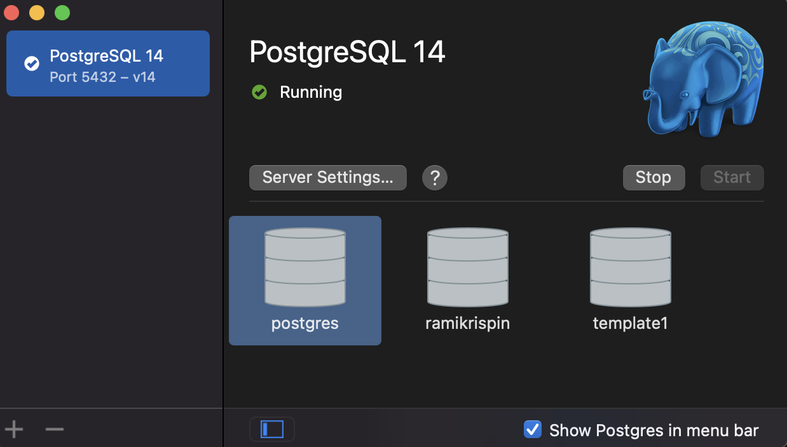
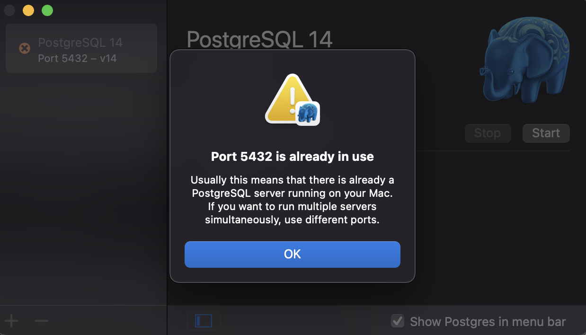
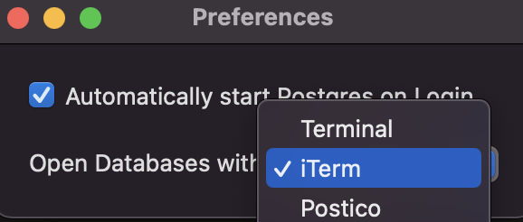
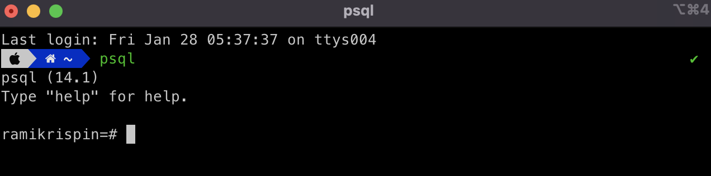

## PostgreSQL Installation


### Definition

* **SQL -** Structured Query Language enables to manage data held in a relational database
* **Relational database -** is a system of tables that have some level of relationship based on a common index
* **PostgreSQL -** is a free and an open-source relational database management system (RDBMS) emphasizing extensibility and SQL compliance. It was originally named POSTGRES, referring to its origins as a successor to the Ingres database developed at the University of California, Berkeley.<sup>2</sup>

### Installation

PostgreSQL supprts most of the common OS such as Windows, macOS, Linux, etc.

To download go to Postgres project [website](https://www.postgresql.org/) and navigate to the **Downlaod** tab and select your OS, which will naviage it to the OS download page, and follow the instraction:

 [</a>](https://www.postgresql.org/download/)


On mac I highly recommand to install PostgreSQL through the [Postgres.app](https://postgresapp.com/):

 [</a>](https://postgresapp.com/)


When opening the app, you should have a default server set to port 5432 (make sure that this port is available):

</a>

To launch the server click on the `start` button:

</a>

By default, the server will create three databases - `postgres`, `YOUR_USER_NAME`, and `template1`. You can add additional server (or remove) by clicking the `+` or `-` symbols on the left botton.


To run Postgres from the terminal you will have to set define the path of the app on your `zshrc` file (on mac) by adding the following line:

``` zsh
export PATH=$PATH:/Applications/Postgres.app/Contents/Versions/14/bin/
```

Where `/Applications/Postgres.app/Contents/Versions/14/bin/` is the local path on my machine.

Alternativly, you can set the alias from the terminal by running the following"


``` zsh
echo "export PATH=$PATH:/Applications/Postgres.app/Contents/Versions/14/bin/" >> ${ZDOTDIR:-$HOME}/.zshrc
```


#### Clear port

If the port you set for the Postgres server is in use you should expect to get the following message when trying to start the server:

</a>

This mean that the port is either used by other Postgres server or other application. To check what ports in use and by which applications you can use the `lsof` function on the terimnal:

``` zsh
sudo lsof -i :5432                                                                                           COMMAND  PID     USER   FD   TYPE             DEVICE SIZE/OFF NODE NAME
postgres 124 postgres    7u  IPv6 0xc250a5ea155736fb      0t0  TCP *:postgresql (LISTEN)
postgres 124 postgres    8u  IPv4 0xc250a5ea164aa3b3      0t0  TCP *:postgresql (LISTEN)
```

Where the `i` argument enables to search by port number, in the example above by `5432`. As can see from the output, the port is used by other Posrgres server. You can clear the port by using the `pkill` command:

``` zsh
sudo pkill -u postgres
```

Where the `u` arugment enbales to define the port you want to clear by the USER field, in this case `postgres`.

**Note:** Before you are clearing the port, make sure you do not need the applications on that port. 


### SSH the database

To open the database on the terminal you can either use the Postgres App or directly on the command line.

#### SSH with the Postgres App
 
The Postgres App enables you to SSH directly to the server via the terminal. On Mac, by default, the app will use the built-in terminal emlator. If you want to change terimnal default setting go to `Preferences...` and select the terminal emlator you want to use:

</a>

Once the Postgres server is up and working, clicking on any of the databases on the server will open the terminal and SSH into the server:


### SSH from the terminal

Alternatively, you can SSH directly from the terminal with the `psql` command:

</a>

By default, the `psql` commend will SSH to the database with the user name, in this case `ramikrispin`. You can use the `dbname` argument to specify the database name:

``` zsh
psql template1                                                 
psql (14.1)
Type "help" for help.

template1=#
```


More options available on the `psql` command [documentation](https://www.postgresql.org/docs/9.2/app-psql.html).


### Sources
* **Tutrial -** https://www.youtube.com/watch?v=qw--VYLpxG4&t=1073s&ab_channel=freeCodeCamp.org
* **PostgreSQL -** https://en.wikipedia.org/wiki/PostgreSQL
* **Documentation -** https://www.postgresql.org/docs/


<sup>1</sup> https://www.freecodecamp.org/news/postgresql-full-course/

<sup>2 </sup> Source [Postgres Wikipedia](https://en.wikipedia.org/wiki/PostgreSQL) page


